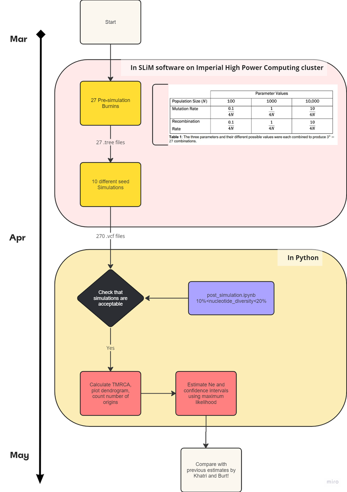

# Undergraduate Final Year Project
## FYP: Why is my population size so small? Estimating recent effective population sizes from resistance loci in Anopheles gambiae

##### Supervised by: Dr Khatri Bhavin

Code used during my undergraduate final year project, with much previous work done by Anushka Thawani, Theo Sebastian Hemmant and other previous students on this project.

### Data Repository for burnins and simulation VCFs which was too big
I need to figure out how to port to github. 
https://imperiallondon-my.sharepoint.com/:f:/g/personal/cqs21_ic_ac_uk/Egu0jDWKCxNBhjx7cOh0s40B6CMgt4aPcoo4BdXK1RVBag?e=6k6hGw

Anusha --> Theo --> Cheyanne --> future student
good luck! jiayou! atb! help! 
- caught some problems, created some problems. win some lose some i guess ;/ 
- ps. I started this github bc the previous students did a ton of useful things but inheriting this project was confusing. good luck future students. hope this is understandable.

# Current Status: 
### Update questions for Bhavin:
- Plot nucleotide diversity for each simulation and also separately ?
- plot number of independent gene loci/origins (L) against population size (N) for each population size?

# Progress from previous FYP:
### Burn in simulations
- previously unable to finish the last 2 but with this optimisation it should
- 70kb burnins (previously 10kb which is ...??not reflective of vgsc size)
- burnin array workflow on HPC (previously a lawless land of ??? a bajillion scripts and a lot of different slim????!)
- added logfile tracking (easier to plot graphs bc we have some data in csv form)

Theo's burnins: missing no.24-27?
NOTE: I changed the calculation method used in calculating heterozygosity, could further improve on it but for now at least it calculates something SIMILAR enough to nucleotide diversity or heterozygosity

### Running SLIM simulations
- wrote array script to do it all for us in HPC (previously a lawless land of ??? a bajillion scripts and a lot of different slim????!)
- optimised! the whole burnin and simulations! much faster!
- made heterozygosity user-defined function 
- made calculate allele_freq function and
- tracking lineages function in SLiM.
- added logfile tracking (easier to plot graphs bc we have some data in csv form) after burnins/simulation (lawless land before this????)
- 10 simulation arrays for the 10 specified seeds

### Post-Simulation Python code
- fixed some issues? i hope in clustering but not everything is fixed
- (post-simulation) plot nuc diversity graph for all simulations and compare against expected (has to be 10%<nuc diversity>20%)
- wrote array job to run the TMRCA calculations, clustering, dendrogram but ran out of time to finish troubleshooting/ HPC died and kept dying throughout May. tuff luck.
- finished TMRCA python calculation code block, DID NOT MANAGE to solved Theos dendrogram clustering problem but ran out of time to check (SLiM outputs vcfs with floating zeros instead of integers which may be the problem (see Theo's report))
- not sure if we can move away from VCFs? or tinker with SLiM to stop doing the floating zeros? or post-simulation convert the VCF floating zeros to nearest integer?

### TO CONTINUE FIXING: 
- clustering by TMRCA, 
- and parallelise the python code for OpenMP in HPC? might need to ask HPC ppl for help here
- can also switch calculation of SHL to use identity by descent (eg. phaseIBD by 23&Me only uses 18.9min of walltime on 100,000 ppl) compared to our 11 hours to more than a week of compute time for this

### Answered questions from supervisor meetings
- how many ticks in a simulation (till 80% fixation for VGSC and 40% for RDL)
- what size of genome  (10kb haplotype from Anusha's report?)
- what kind of mutations do i want to sweep?? VGSC and RDL mutations [initializeMutationType("m1", 0.5, "f", 0.02); // introduced sweep mutation dominance is likely partial ]
- how many repeats of the soft sweep simulations? 
    - as many as I can. at least 10 (is roughly 1/3 error, having 100 repeats is 10% error)
    - just 1 subpopulation
- why do previous FYP students use Farthest Point Algorithm in the dendrogram clustering?? Should be average UPGMA algorithm.
- can we do our neutral burn in for 10N generations (page 597 of SLIM manual) incase not enough coalescence? record the number of generations first
- issue with new calculation compute time: calculate heterozygosity every set timepoint instead of every generation for problematic burn ins
