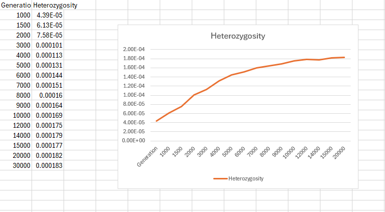

# Undergraduate Final Year Project
## FYP: Why is my population size so small? Estimating recent effective population sizes from resistance loci in Anopheles gambiae

##### Supervised by: Dr Khatri Bhavin

Code used during my undergraduate final year project, with much previous work done by Anushka Thawani, Theo Sebastian Hemmant and other previous students on this project.

### Data Repository
https://imperiallondon-my.sharepoint.com/:f:/g/personal/cqs21_ic_ac_uk/Egu0jDWKCxNBhjx7cOh0s40B6CMgt4aPcoo4BdXK1RVBag?e=6k6hGw

.png>)

### Burn in simulations
completed by me: all burnins run (all finished before termination point 100k ticks)
Theo's burnins: NOTE: wrong calculation method used in calculating heterozygosity [theo's burnins are missing no.24]

### Running SLIM simulations via HPC 
- made parameter combination.txt, and job script
- run simulations (BUT most of them do not reach 0.8 heterozygosity, only terminate at termination point 1000k)

### Post-Simulation Python code
- done with TMRCA code
- TO CHECK: cluster by TMRCA and draw tree with tips coloured for mutations. adapt for figures later

### Haplotype graph tests
- Work done by TSH11, Anusha and previous students

# Current Status: Done with seed 1 simulations
### Update questions:
- confused with the post-simulation check... 
    Plot nucleotide diversity for each simulation and also separately 
    plot number of independent gene loci/origins (L) against population size (N) for each population size?

### Progress since 19 March:
- all 27 burn ins done on HPC, made heterozygosity user-defined function + track progress to csv using logfile
- finished TMRCA python calculation code block, simulation array
- finished simulations. output vcf for 10,11,19-23. Expired at 1000k for the rest.
- did poster

### Planned work this week
- finish burnins! (done)
- change sweep site nonsense in simulation SLIM script (done)
- fix and run simulation array for first seed (done)
- write array scripts for 9 other seeds and run them
- (tmrca.ipynb) calculating NeHat by maximum likelihood estimation (STUCK HERE, how to get estimated curve of best fit?)
- (post-simulation) plot nuc diversity graph for all simulations and compare against expected (has to be 10%<nuc diversity>20%)

- begin report writing

# Optimising HPC work
- most burnins reach 10% heterozygosity between 10-100k gen
- trial 1 took 8.5 hr to reach gen 40k and terminate (achieved optimisation!)

- trial 2 using logfile took user-defined heterozygosity function every 1000 ticks, and also increase the expiry point from 40k to 100k gen to see if there is indeed a plateau. removed a lot of savepoints as now we know the burnin can finish under 72 hr.

- optimising simulations, termination block at 1000k gen to catch any long simulations (most dont finish at 200k)
- VCF files take up >20gb each! switch to outputting in .tree? or compute all the following steps Then tar.gz the entire simulation folder before running other seeds

# Answered questions
- how many ticks in a simulation (till 80% fixation for VGSC and 40% for RDL)
- what size of genome  (10kb haplotype from Anusha's report?)
- what kind of mutations do i want to sweep?? VGSC and RDL mutations [initializeMutationType("m1", 0.5, "f", 0.02); // introduced sweep mutation dominance is likely partial ]
- how many repeats of the soft sweep simulations? 
    - as many as I can. at least 10 (is roughly 1/3 error, having 100 repeats is 10% error)
    - just 1 subpopulation
- why do we use the Farthest Point Algorithm in the dendrogram clustering?? Should be average UPGMA algorithm
- can we do our neutral burn in for 10N generations (page 597 of SLIM manual) incase not enough coalescence? record the number of generations first
- issue with calculation compute time: calculate heterozygosity every set timepoint instead of every generation for problematic burn ins
