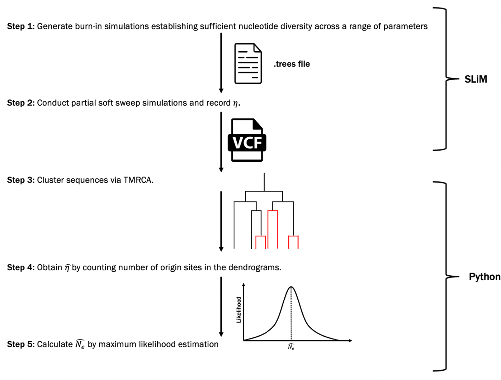

# Undergraduate Final Year Project
## FYP: Why is my population size so small? Estimating recent effective population sizes from resistance loci in Anopheles gambiae

##### Supervised by: Dr Khatri Bhavin

Code used during my undergraduate final year project, with much previous work done by Anushka Thawani, Theo Sebastian Hemmant and other previous students on this project.

### Burn in simulations
SLIM Burn in Code but NO simulated burn in populations from previous students

### Running SLIM simulations via HPC 
- made parameter combination.txt, and draft job script
- TO DO: currently drafting python script (slim code)

### Python code
- almost done with TMRCA code
- TO DO: cluster by TMRCA and draw tree with tips coloured for mutations. adapt for figures later

### Haplotype graph tests
- Work done by TSH11, Anusha and previous students
- TO DO: Add my own calculated graphs etc

- how many ticks in a simulation (till 80% fixation for VGSC and 40% for RDL)
- what size of genome  (10kb haplotype from Anusha's report?)
- what kind of mutations do i want to sweep?? VGSC and RDL mutations

- how many repeats of the soft sweep simulations? as many as I can. at least 10 (is roughly 1/3 error, having 100 repeats is 10% error)
    - just 1 subpopulation

# Current Status
### Update questions:
- #why do we use the Farthest Point Algorithm in the dendrogram clustering??

### Progress since last update meeting (19 March):
- fixed Theo's Burn in SLIM code
- 18 burn ins done on HPC
- burn in array job IS PROBLEMATIC

- edited SLIM simulation to have VGSC mutation parameters
- trial one SLIM simulation on my own PC (4 cores, definitely more than 1 day to run)

- finished TMRCA python calculation code block
- At clustering/ draw dendrogram codeblock now

### Planned work till 29 March:
1. draft the poster and ask josh for feedback
2. troubleshoot my array job script and SLIM/Python script for simulations
3. ~~write script to run all the burn in simulations in HPC (in case Theo does not reply Dr Khatri)~~
4. use the python code to write a test.vcf file (lots of 0,1 etc)
5. trial 1 simulation from burn in on HPC to get idea of how many cores etc I need, save the data to the RDS

### planned work over EASTER
1. set the HPC to run all my simulations over Easter break (with as many repeats)
2. ~~finish TMRCA python calculation, add codeblock to cluster and draw tree with tips coloured for mutations. adapt for figures later~~